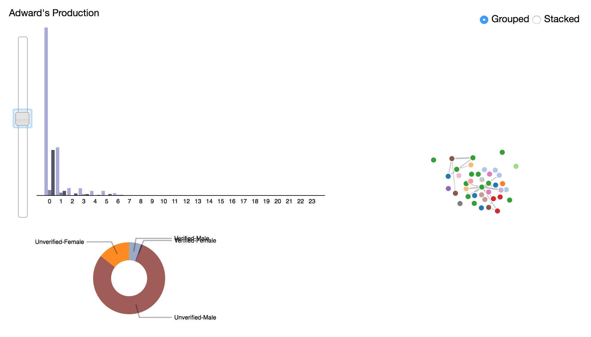
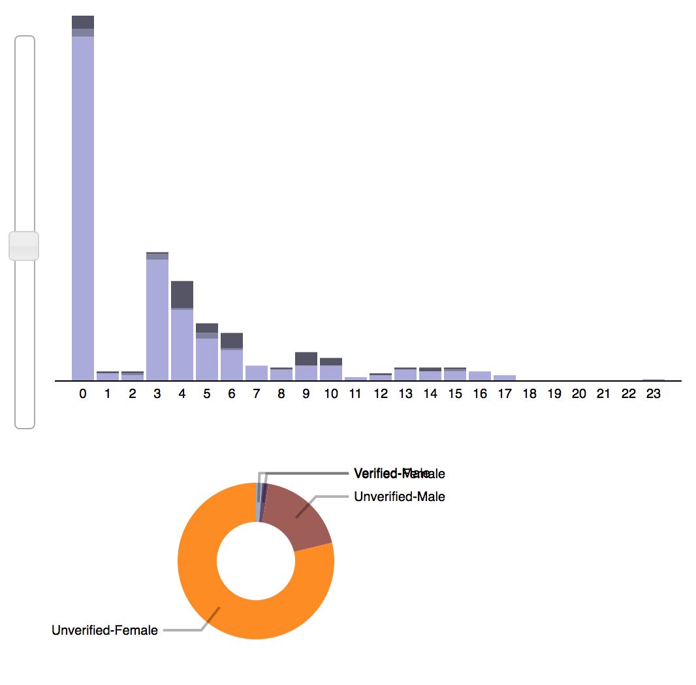
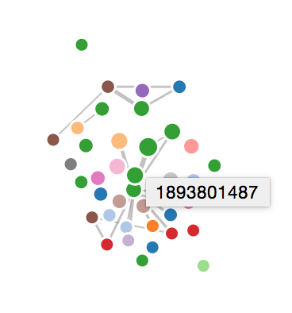

#InfoVis Individual Task [A1] - Doc

========

###**3130000020 董可扬**

--------

#I. 系统概述

>本系统被实现为一个主要由三个数据布局构成、存在多关联视图、且支持多种交互模式的网页端信息可视化系统，其中：

 - ###源数据
 >基于2014年度上半年爬取的部分新浪微博热点转发数据，主要包括1000条源微博、它们所有的转发链数据和参与转发的用户主干信息等，在项目的`data/`文件夹下可找到`TestData_Example.xlsx`作为示例；
 
 - ###布局
 
   - 参考自[Stacked Bars](http://bl.ocks.org/mbostock/3943967)，表达某条源微博自发布到数据采集时刻，出现的转发数量随时间推演的变化趋势，其中栈中不同颜色的三层自下而上（自浅到深）分别表示一级转发、二级转发和至少经历三级的转发微博相对数量；
   
   - 参考自[Force-Directed Graph](http://bl.ocks.org/mbostock/4062045)，表达全部1000条微博内容的转发中参与的已受官方认证用户（即“大V”）的相互联系程度，其中相同省份编号的用户帐号被归为同一个Group，标为同一种颜色，两个帐号之间的连结强度取决于他们出现在同一篇源微博的转发链中的频度，体现为距离较近、呈环绕成团现象或较难被扯开；
   
   - 参考自[Animated Donut Chart with Labels](http://bl.ocks.org/dbuezas/9306799)：表达某条源微博相关的[认证与否，性别]二元数据的比例统计信息；
   
 - ###交互模式
 
 	- Stacked Bars支持使用右上角的Radio Button在堆栈式和分组式之间切换同一组数据（基于同一源微博）的显示效果，并伴有平滑的动画效果；
 	
 	- 引入JQuery的Slider控件，滑动之可同时使得Stacked Bars与Donut Chart响应，即在400条不同的源微博数据集之间切换，并即随着平滑的动画效果而改变视图；
 	
 	- Force-Directed Graph支持扯动顶点，观察连结度强弱对于顶点力学行为的影响，而从直观上体会到同组或不同组别的认证用户之间的关系特性；
 	
 	- 光标在Force-Directed Graph上划过时有鱼眼扭曲效果，方便放大细节，更清楚地查看细微的连接状况。

#II. 运行环境及库依赖关系

 - ###运行环境
	
	- 在最新稳定版本（截至2015.1.9）的Safari和Firefox浏览器下测试通过，浏览器必须支持运行`Javascript`；
	
	- 如果已经安装了Python，在终端下进入本项目主目录并键入命令`python -m SimpleHTTPServer`即可在浏览器中使用`http://localhost:8000/`体验效果；
	
	- 若默认端口被本地其他程序占用，则需要在命令中额外指定一个空闲端口：`python -m SimpleHTTPServer [port-number]`；
	
	- 若未设置Python在系统中的环境变量，则需要用python程序的全路径来代替`"python"`；
	
	- 在Mac OS X下，也可以使用前端开发工具Coda 2直接打开`index.html`预览实时效果。
	
 - ###引用的外部库
 
 	- 以[`d3.js`](http://d3js.org)作为支持数据可视化效果呈现的主要Javascript库，即项目目录中的`lib/d3.v3.min.js`；
 	
 	- 引用了`lib/fisheye.js`来实现力学引导图的仿鱼眼扭曲交互效果；
 	
 	- 引用了`JQuery`和`JQuery-UI`的外部库来插入滑块Slider控件，即`lib/jquery.min.js`和`lib/jquery-ui.min.js`；
 	
 	- 引用了`/lib/jquery-ui.min.css`样式表来支持JQuery控件的正确显示；
 	
 	- 预处理数据格式及获取统计数据时引用了Python的`xlrd`和`xlwt`库以便读写excel表中存储的源数据。

#III. 项目文件结构和详解

##.

 - ##index.html
 	主要的数据展示和交互接口，包含本人撰写的所有Javascript脚本；
 
 - ##*data/*
 	>包含各数据视图需要加载的序列化数据`*.json`和源数据表样例：
 
 	- ###weibo.json
 		经过转换的、各条源微博转发量与时间关系的结构化数据，由Stacked Bars视图加载；
 		
 	- ###repost_users.json
 		经过转换的微博大V之间联系强度的结构化数据，由Force-directed Graph视图加载；
 	
 	- ###donut.json
 		经过转换的、各条微博转发用户中性别和是否官方认证的比例数据，由Donut Chart视图加载为类似为饼图的形式；
 		
 	- ###TestData_Example.xlsx
 		以下各脚本需要用到的源数据表样例，由去年通过内部API和WeiboSpider爬虫抓取新浪微博数据而生成，有效信息包括转发工作簿和参与转发的用户信息工作簿；
 	
 	- ###LevelData_Example.xlsx
 		通过脚本改写源数据表的转发工作簿`tweet`并增加统计了该条转发的级数这一字段而生成的次级源数据表（样例）；
 		
 - ##*data_generator/*
 	>包含读取源数据表、生成`data/`中各序列化数据文件所需要的各脚本和中间文件：
 
 	- ###cnt_spread_level.py
 		统计每张`/TestData/`表中的转发关系并将新增的“Spread Level”字段（即转发级数）写入/LevelData/中的对应新表的脚本；
 		
 	- ###weibo_json_generator.py
 		从`/LevelData/`中的各个表提取各源微博的转发数与时间段的对应关系，并写入`weibo.json`；其中横座标时间从最早到最晚的转发被等距分为24段，分别统计；
  
 	- ###v_users_select.py
 		从源数据的表（全部）中选择出参与过超过15条微博的转发的大V用户ID，并写入`v_user.txt`；
 	
 	- ###v_user.txt
 		包含满足一定参与度的大V用户ID列表，以备其他脚本后续处理的时候读取并判断用户出现在数据视图中的资格；
 		
 	- ###test.py
 		测试的时候读取`test.txt`修改为`v_user.txt`格式的脚本，现在已经不再使用而整合到`v_users_select.py`中；
 		
 	- ###test.txt
 		测试的时候`v_users_select.py`先写入该文本文档，已经不再使用；
 	
 	- ###force_graph_json_generator.py
 		从`/TestData/`中的各数据表读取信息，并参考`v_user.txt`，统计符合条件的大V的分组和连结度信息，写入`repost_users.json`的脚本；
 		
 	- ###donut_json_generator.py
 		从`/TestData/`各数据表中读取信息，并统计“已认证|男”、“已认证|女”、“未认证|男”、“未认证|女”用户在各条源微博的所有转发中的参与数量，写入`donut.json`；
 		
  - ##*lib/*
    >包含下载到本地的部分外部库。
 	
 
 
#IV. 关键算法、代码和技术难点

 - 为了保证三个数据视图和JQuery滑块控件所绑定的函数都能够按正确的顺序获取到支持显示所需的序列化数据对象，解决Javascript的异步加载问题所带来的困惑，采取了嵌套`d3.json()`函数的写法：
 
 	    d3.json("data/weibo.json",function(error,root){
 	    	//...
 	    	$(function() {
 	    		var select = d3.select("svg");
		 		var slider = $( "

" )
		 			.insertAfter( select ).slider({
		 			//... //JQuery slider attr
		 			slide: function(event,ui){
		 			//... //Bounded function sliding action  
		 			}
		 		});
 	    	});
 	    	
 			d3.json("data/repost_users.json",function(error,graph)
 				//...
 				d3.json("data/donut.json",function(error,root){
 					//...
 				});
 	    	});
 	    });
 		
 - 用`d3.json()`一次性加载全部1000条微博对应的`weibo.json`会导致得到“undefined”，缩小数据规模到400条才能够得到数据后正确显示。
 
 
#V. 参考资料

 1. ###D3JS官方文档：
 	`https://github.com/mbostock/d3/wiki`
 
 2. ###D3JS官方示例代码库：
 	`https://github.com/mbostock/d3/wiki/Gallery`
 
 3. ###W3CSchool Javascript教程：
 	`http://www.w3school.com.cn/js/index.asp`
 
 4. ###数据可视化专题站：
 	`http://www.ourd3js.com/wordpress/?cat=2`

#VI. 系统运行截图

##整体效果

##拖动控件滑块后左侧两图相应地同步改变

##力学图的鱼眼效果（做了限制以免夸张的缩放影响拖拽和显示）

